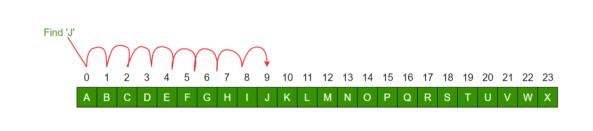
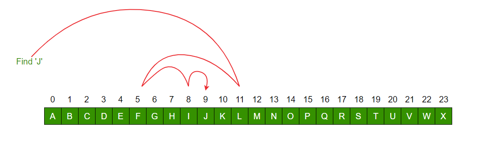

# Linear Search vs Binary Search

# Applications of Linear Search Algorithm:
* Unsorted Lists: When we have an unsorted array or list, linear search is most commonly used to find any element in the collection.
* Small Data Sets: Linear Search is preferred over binary search when we have small data sets with
* Searching Linked Lists: In linked list implementations, linear search is commonly used to find elements within the list. Each node is checked sequentially until the desired element is found.
* Simple Implementation: Linear Search is much easier to understand and implement as compared to Binary Search or Ternary Search.

# Advantages of Linear Search Algorithm:
Linear search can be used irrespective of whether the array is sorted or not. 
It can be used on arrays of any data type. Does not require any additional memory.
It is a well-suited algorithm for small datasets. performs equality comparisons

# Disadvantages of Linear Search Algorithm:
Linear search has a time complexity of O(N), which in turn makes it slow for large datasets. Not suitable for large arrays.

# When to use Linear Search Algorithm?
When we are dealing with a small dataset.
when we have Multidimensional.
When you are searching for a dataset stored in contiguous memory.


# Applications of Binary Search Algorithm:
* Binary search can be used as a building block for more complex algorithms used in machine learning, such as algorithms for training neural networks or finding the optimal hyperparameters for a model.
* It can be used for searching in computer graphics such as algorithms for ray tracing or texture mapping.
* It can be used for searching a database.

# Advantages of Binary Search:
* Binary search is faster than linear search, especially for large arrays.
* Binary search is well-suited for searching large datasets that are stored in external memory, such as on a hard drive or in the cloud.

# Disadvantages of Binary Search:
* The array should be sorted.
* Binary search requires that the data structure being searched be stored in contiguous memory locations.
* Binary search requires that the elements of the array be comparable, meaning that they must be able to be ordered.
* Can use in Only single dimensional


* Linear Search: input data need not to be in sorted.
* Binary Search: input data need to be in sorted order.

* Linear Search: is also called sequential search.
* Binary Search: is also called half-interval search.

* The time complexity of linear search O(n).
* The time complexity of binary search O(log n).

* Linear Search: Multidimensional array can be used.
* Binary Search: Only single dimensional array is used.

* Linear Search: performs equality comparisons,less complex,very slow process.
* Binary Search: performs ordering comparisons,more complex,very fast process.


Let us look at an example to compare two:

Linear serach to find element "J" in a given sorted list from A-X 



Binary serach to find element "J" in a given sorted list from A-X


```


```